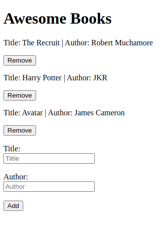

# Awesome Books

> A simple website that display books.

You can add and remove books from the list.

## Built With

- JavaScript

## Live Demo

[Live Demo Link](https://leandro-barretoo.github.io/AwesomeBooks/)

## Getting Started

To get a local copy up and running follow these simple example steps.

### Setup

- Clone the repo `git clone git@github.com:Leandro-Barretoo/AwesomeBooks`
- `cd` into the directory
- checkout to the htmlstage branch `git chechout htmlstage`
- open in your desired code editor

## Authors

👤 **Leandro Barreto**

- GitHub: [@Leandro-Barretoo](https://github.com/Leandro-Barretoo)
- LinkedIn: [Leandro Barreto](https://www.linkedin.com/in/leandroobarreto/)

👤 **Author2**

- GitHub: [@luqmanmusah](https://github.com/luqmanmusah)
- LinkedIn: [Luqman Musah](https://www.linkedin.com/in/luqman-musah/)

## 🤝 Contributing

Contributions, issues, and feature requests are welcome!

Feel free to check the [issues page](../../issues/).

## Show your support

Give a ⭐️ if you like this project!

## Acknowledgments

- MDN Web Docs

## 📝 License

This project is [MIT](./MIT.md) licensed.
